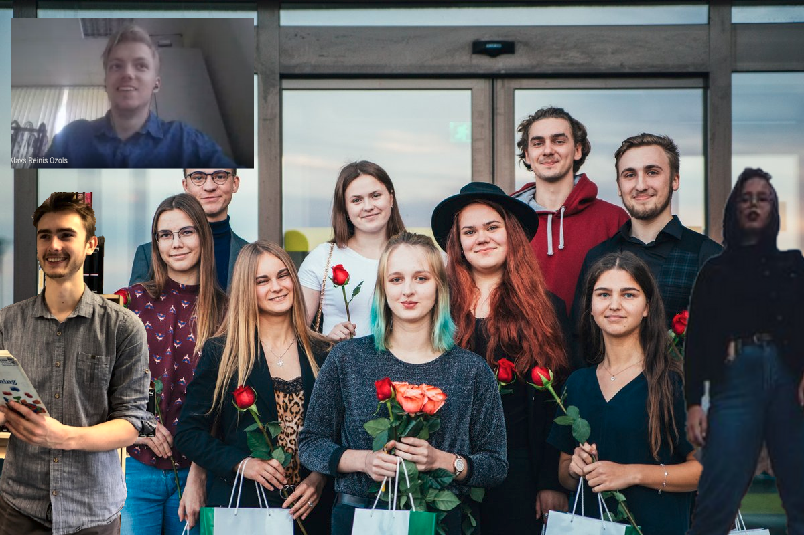

### Katra trešā studentu padome nāk ar savu mājaslapu

Tas ir kā apburtais loks. Ko viens ceļ, to otrs gāž. VeA SP 2019/2020 gadā
izvēlējās iepriekšējo mājaslapu iznīcināt no eksistences, kuru bija izveidojis
aiz-iepriekšējais sabiedrisko attiecību speciālists Raitis Ralfs Vecmanis. Jāsaka gan, ka tā arī
netika uzturēta, maksāt naudu par domēnu tāpat vien jau arī nav diez ko prātīgi.

Katrai trešajai studentu padomei ir sava mājaslapa. Dažiem labāka, dažiem sliktāka, bet
vismaz šis ir centies radīt vienotu vietu kur regulāri apokopot informāciju, radīt vietu, kur regulāri
varētu veidot kopīgu nākotni ar iespēju saglabāt vēsturi, lai visiem ir kur atskatīties.

Kā arī izaicinājums visām nākošajām Ventspils Augstskoals Studentu Padomēm - nenogaliniet šo mājaslapu, bet ļaujiet tai augt!

Studentu Padome, kas šoreiz aktīvi un cītīgi darbojās 2020/2021 studiju gadā cauri COVID-19 pandēmijas laikam. ir apskatāma attēlā zemāk.

*PS. two of these are not like the others*

Šoreiz šīs lapas pamatus ir izveidojis Roberts Ivanovs. Tas tā, ja nu kāds man grib darbu piedāvāt.
